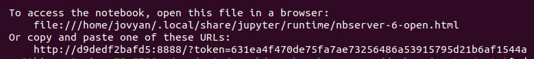

# spark-schema-merge
Spark app to merge different schemas.

# Setup and run via Jupyter Notebook

Clone the project.
```
git clone https://github.com/cordon-thiago/spark-schema-merge
```

If you want to use Jupyter Notebook, follow these steps:

1 - Build docker image.
```
cd spark-schema-merge/docker-jupyter
docker build -t jupyter/all-spark-notebook-custom .
```

2 - Start docker container.
```
docker-compose up -d
```

3 - Get the notebook URL.
``` 
docker logs docker-jupyter_spark_1 
``` 
The output of the log contains the URL to the notebook:



4 - Run the notebook **mergeSchemas.ipynb**
* You can choose the file format to generate the data (`parquet` or `avro`) in the variable `file_format`.


# Setup and run via Spark Cluster

If you want to use a Spark Cluster, follow these steps:

1 - Build docker image.
``` 
cd spark-schema-merge/docker-spark
docker build -t bitnami/spark:3 .
``` 

2 - Start docker container.
```
docker-compose up -d
```

3 - Run the spark application via spark-submit.

To generate parquet files:
```
docker exec -it docker-spark_spark_1 spark-submit --master spark://spark:7077 /home/spark-apps/dataGeneratorDriver.py parquet test_data 10
```
* Parameters
  * File format (parquet or avro).
  * Entity base name. It will be concatenated with the file format.
  * Number of rows to generate.

To read and merge the schema of parquet files generated:
```
docker exec -it docker-spark_spark_1 spark-submit --master spark://spark:7077 /home/spark-apps/mergeSchemaDriver.py parquet test_data I
```
* Parameters
  * File format (parquet or avro).
  * Entity base name. It will be concatenated with the file format.
  * Mode: I = Incremental (read only new or modified partitions); F = Full (read all partitions).

To generate avro files and merge them, just change the first variable in both applications.

4 - Optionally, you can access the spark UI to check the process running: http://localhost:8080

# Notes

* If you already run one of the solutions above (Jupyter Notebook or Spark Cluster) and want to run the other, clean the spark-data directory before. It will prevent from this error when creating the files: *java.io.IOException: Mkdirs failed to create file*.
    ```
    cd spark-schema-merge/aux-scripts
    sudo ./remove-files.sh
    ```
* The spark-avro dependency in Spark Cluster is solved in dockerfile with the download of the jar `spark-avro_2.12-3.0.1`.